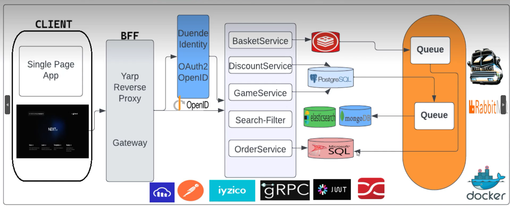

# GameStore-Microservice



## Project Description

**GameStore-Microservice** is a highly scalable microservice-based project developed for game sales and management. This project is built with modern technologies and provides high performance and flexibility on both backend and frontend.

### Technologies
- **Backend:** ASP.NET Core (.NET 8)
- **Frontend:** Next.js 14
- **State Management:** Zustand
- **Messaging and Communication:**
  - **gRPC:** Fast and reliable inter-service communication.
  - **RabbitMQ:** Messaging and asynchronous process management.
  - **SignalR:** Real-time notifications and messaging.
- **Databases:**
  - PostgreSQL
  - MSSQL
  - MongoDB
  - Redis (For caching)
- **Elasticsearch:** Advanced search and filtering functions.
- **Cloudinary:** Image and media management.
- **YARP Reverse Proxy:** Service routing and load balancing.
- **Duende IdentityServer:** Authentication and authorization.
- **JWT (JSON Web Token):** Secure API access.
- **Iyzipay:** Payment processing integration.

## Microservices and Their Functions

The project includes the following microservices:

- **Basket Service**: Manages user shopping cart operations.
- **Discount Service**: Manages discounts and campaign creation.
- **Filter Service**: Handles game and product filtering operations.
- **Game Service**: Manages game information and stock control.
- **Gateway Service**: Routes services using YARP Reverse Proxy.
- **Identity Service**: Manages user authentication and authorization.
- **Order Service**: Manages order operations and payment processes.
- **Search Service**: Provides advanced search functionality over games and user data using Elasticsearch.

## Project Architecture

The **GameStore-Microservice** project is based on a microservice architecture that allows independent development and deployment of each service. This structure provides flexibility for horizontal and vertical scaling. Services communicate using methods like `gRPC`, `RabbitMQ`, and `SignalR`.


## Installation and Setup

### Requirements
- .NET 8 or later
- Node.js 20 or later
- Docker and Docker Compose
- PostgreSQL, MSSQL, MongoDB

### Installation Steps

1. **Clone the Project:**
   ```bash
   git clone https://github.com/serkanaplan/GameStore-Microservice.git
   cd GameStore-Microservice
